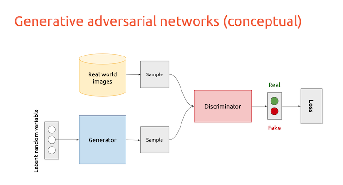
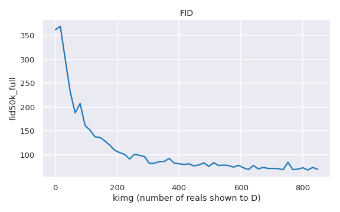
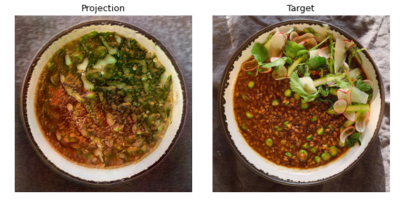
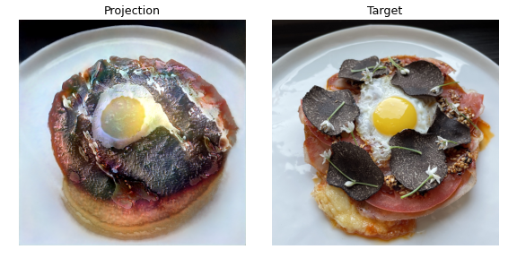
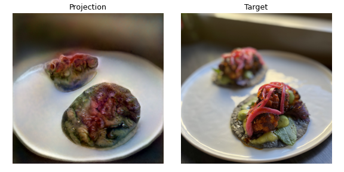
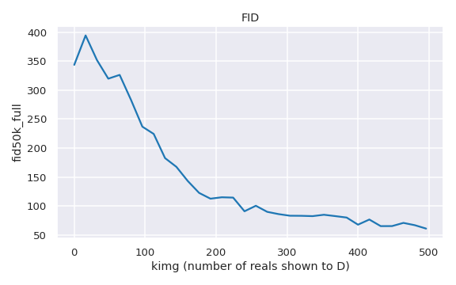
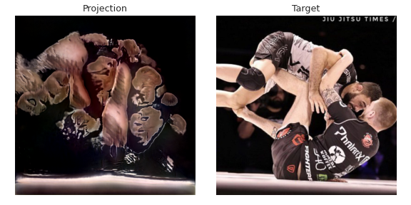
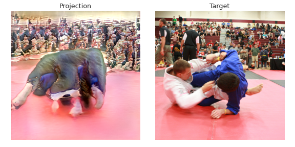
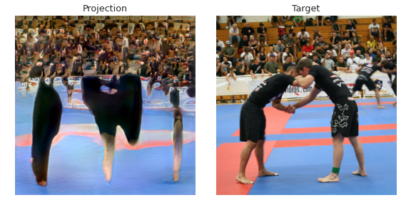

# GANs for Generative Art

Generative Adversarial Networks (GANs) are deep learning generative models which learn to generate new instances of whatever data they have been trained on. Once a GAN has estimated the distribution of the training data, it learns how to map latent codes (such as a vector of 512 numbers) to specific outputs. This learned latent space can be exploited to create interpolation videos, which can be used to market a product/business or can be sold on their own as NFTs. The use of GANs as part of a digital art practice is relatively new and currently popular among AI artists. 

This project implements the Pytorch version of StyleGAN2-ADA and explores the creative potential of the GAN latent space. The goal is to generate novel promotional videos for businesses like Malli, a Los Angeles-based pop-up restaurant, as well as NFTs. The GANs trained in this project have been aptly named **malliGAN** (a GAN for generating new instances of food images) and **grappleGAN** (a GAN for generating images of people grappling).

## Background

The **Generative modeling framework** is as follows [1]:

- We have a dataset of observations X. 
- We assume that the observations have been generated according to some unknown distribution, $\rho_{data}$.
- A generative model $\rho_{model}$ tries to mimic $\rho_{data}$. If we achieve this goal, we can sample from $\rho_{model}$ to generate observations that appear to have been drawn from $\rho_{data}$.
- We are impressed by $\rho_{model}$ if:
> 1. It can generate samples that appear to have been drawn from $\rho_{data}$.
> 2. It can generate samples that are suitably different from the observations in X. That is, the model should not reproduce any of the observations it was trained on.

GANs were first proposed by Ian Goodfellow et. al. in 2014 to overcome the drawbacks of other generative models that were prevalent at the time. A GAN is comprised of two neural networks that are trained in an adversarial process:
- Generator (G): converts a fixed-length random vector (a latent code) into some kind of output (like images) based on the weights it has learned during training
- Discriminator (D): a classifier that is trained to predict whether a sample is real (from the training dataset) or fake (made by the Generator)



[Image source][]

[Image source]: https://www.slideshare.net/xavigiro/deep-learning-for-computer-vision-generative-models-and-adversarial-training-upc-2016?from_action=save

The two networks are trained together. G generates a batch of samples, which are shown to D along with real images. D classifies the images as "real" or "fake". In subsequent rounds, D is updated to get better at discriminating between real and fake samples while G is updated to get better at fooling D. In this process, G is learning the best possible approximation of the distribution that could have produced the real-world data (the best posible $\rho_{model}$). Ideally, the generated images will become impossible to distinguish from the real images over time. 

In 2018, NVIDIA labs developed StyleGAN, which caused a large buzz in the media with its generation of high quality images of fake human faces. StyleGAN uses Progressive Growing (from the earlier PC-GAN) to generate high-resolution images and incorporates image styles into each layer of G. The result is an architecture that allows for the generation of large images with increased control over image synthesis [3]. The team made further improvements with StyleGAN2. Among other changes, StyleGAN2 replaced Progressive Growing with a hierarchal G with skip connections. StyleGAN2 addresses the droplet artifacts produced by its predecessor and generates even more realistic images. Researchers recognized that a reduction in the number of images required to start training would be beneficial in many applications of generative modeling, so StyleGAN2-ADA was born [2]. GANs typically require tens of thousands to train properly, as using too little data tends to lead to overfitting in D. D will fail to provide useful feedback to the generator and training diverges. With its Adaptive Discriminator Augmentation (ADA) feature, StyleGAN2-ADA dynamically changes the amount of non-leaking image augmentations as needed throughout training. **StyleGAN2-ADA is the model of choice for this project, as it is ideal for stabilizing training in the case of limited data.**

## Data Preparation

Data collection and preparation involved the following steps:
1. Obtain raw images from business owner (malliGAN) and scrape images from the internet (grappleGAN)
2. Remove duplicates and irrelevant images 
3. Convert images to square, same power-of-two dimensions, and uniform color space
4. Convert images to multi-resolution TFRecords

For malliGAN, 392 iphone food images were provided by the owner of Malli, a Los Angeles-based pop-up restaurant business. For grappleGAN, Selenium was used to scrape images of people grappling from Instagram and Flickr. Images were downloaded from the Instagram account of John Danaher (@danaherjohn), from the hashtag #nogiworlds2018, and a Flickr search with keywords "nogi jiu jitsu". The dataset was to contain only images where two grapplers in action were the focal point, so some images needed to be removed. This included photos of competition winners at the podium and photos where too many non-grapplers crowding the focal point. After removing irrelevant images, the grappleGAN dataset contained 2,147 images.

StyleGAN2-ADA requires images that are square, with length and width at a power of 2. The ImageMagick suite was used to convert all images to 1024x1024, jpg format, and the RGB color space. Some grappling images had one or more dimensions smaller than 1024, so these were upsampled. Most images were center cropped automatically with ImageMagick commands, but some needed to be cropped manually.

The cleaned images were uploaded as folders to Google Drive. Training-ready datasets in the `.tfrecords` format were created from these folders using `dataset_tool.py` from the official StyleGAN2-ADA repository. The converted TFRecords datasets, original image folders, and training results were all stored on and accessed from Google Drive throughout training.

## malliGAN

StyleGAN2-ADA was trained on 392 food images in Google Colab, a cloud-based IDE environment that provides access to a dedicated GPU.

The set-up for the training environment in Google Colab consists of:
1. Connecting to a GPU with a High-RAM runtime shape
2. Mount google drive to store datasets and training results
3. Install the required version of PyTorch and other necessary python libraries
4. Clone the official NVIDIA StyleGAN2-ADA repository (Pytorch version)
5. Train the network with the desired settings

Colab Pro is said to allow users up to 24 hours of runtime. In practice, the models trained for up to 19 hours at a time before Colab would time out, at which point training would be resumed from the most recently saved `.pkl` file. Training speed varied between runs depending on what GPU what available.

### Modeling

malliGAN trained for 6-7 days.
The configurations and command to kick off training for this GAN:

```python
RESULTS = "/content/drive/MyDrive/malliGAN/results"
DATA = "/content/drive/MyDrive/malliGAN/datasets/food-eheitner1024"
SNAP = 4
MIRRORED = True
AUG = "ada"
AUGPIPE = "bgcfnc"
TARGET = 0.7

cmd = f"/usr/bin/python3 /content/stylegan2-ada-pytorch/train.py --snap {SNAP} --outdir {RESULTS} --data {DATA} --mirror {MIRRORED} --aug {AUG} --augpipe {AUGPIPE} --target {TARGET}"
!{cmd}
```

`RESULTS` indicates the directory where the training results will be stored while `DATA` points to the location of the TFRecords dataset. The training exports network pickles (`network-snapshot-<KIMG>.pkl`), example fake images, and FID scores at regular intervals controlled by `--snap`. In this case, `SNAP = 4`, so these results were saved every 4 ticks or every 16K real images shown to D.

The remaining arguments control how the data is augmented. Data augmentation is a great solution to avoid overfitting in discriminative modeling, but this can cause problems for GANs. Augmentations can "leak" into the generated samples, meaning that the generator will learn the augmented distribution and produce fakes that resemble the transformed training images. 

One leaky augmentation was enabled by setting `--mirror` to `True`, which augments the dataset by 2x through x-flips (horizontal flips). This increased the number of images from 392 to 784. No vertical flips were performed since most images clearly had a "right side up" and it was not desirable for the generator to produce upside down images of food.

Augmentations are non-leaking on the condition that they are skipped with non-zero probability. The ADA feature of StyleGAN2-ADA allows the GAN to dynamically change the amount of non-leaking augmentations throughout training based on the degree of overfitting or underfitting. The strength of augmentation is controlled by the hyperparameter `p`, which can range from 0 to 1.

Setting `--aug` to `"ada"` enables Adaptive Discriminator Augmentation. Initially, all available augmentations were enabled with `--augpipe` set to `"bgcfnc"`, a set of 18 transformations grouped into 6 categories: pixel blitting (x-flips, rotations, integer translation), geometric transformations, color transforms, image-space filtering, additive noise, and cutout. `--target` sets the maximum value for `p`. According to the StyleGAN2-ADA paper, the augmentations tend to become leaky when `p` approaches 1. `--target` was set to 0.7 so that `p` would not exceed 0.7 during training. After a few runs, `--augpipe` was set to `"bgc"`. In a future experiment, augmentation settings should be kept the same throughout the training process.

### Results

Quantitative measures like Frechet Inception Distance can be combined with qualitative assessment to evaluate GAN performance.

#### Frechet Inception Distance (FID)

The Frechet Inception Distance is a metric that captures the similarity between the generated and real images. The distributions of some neural network features are found for the generated and real images by feeding the them into a pre-trained model such as Inception v3. FID uses the means and covariances of the distributions to calculate the distance between them. Shorter distances have been shown to correlate to higher quality images.

FID scores were computed between 50K training images and the full training dataset. Training progress is measured in Kimg (reals) shown to D. 



The most progress occurs between 0 and 200kimg. FID decreases slowly beyond this point and seems to plateau around 600kimg.

#### Qualitative assessment
Checking the generator output against the real images:

***Reals (training images)***

")
<br>
<br>
***Fakes (generated images)***

")

The GAN appears to have learned the color variation in the original dataset. It attempts a good variety of dishes, but it has trouble with detail, surfaces, multiple dishes, and perspective. Some dishes look edible from afar, but most look like food from an alien planet and individual ingredients are not so identifiable.

The lack of realism in the generated images is likely due to a lack of training data. Although StyleGAN2-ADA is designed for limited data regimes, a dataset of 392 images was still too little to learn $\rho_{data}$. The GAN may perform much better on at least 1K images, but 392 images was all the business had at the time. The trend of the FID plot suggests that additional training time would not improve the model by much.

### Latent Space Exploration

In deep learning, the latent space is essentially a compressed representation of data. The input to the Generator is a latent code `z`, a vector of numbers. For StyleGAN2-ADA, `z` is a vector of 512 numbers. Each Generator output can be mapped latent code, and one can transition/interpolate between two latent codes in the compressed space. Visualizing this transition means also visualizing the codes in between these two points, creating a "morph" effect. 

The following video was created by interpolating between 9 fake images. That is, the latent space is being traversed between 9 latent codes that correspond to our chosen fakes.

#### Interpolation video

[Link to YouTube video][]

[Link to YouTube video]: https://youtu.be/ADNSTtbMlXE

#### Projections

By projecting a real image into the latent space, the GAN can find the latent code for the real image (the target) based on what it has learned. An image generated from this latent code is essentially the GAN's attempt to recreate the target image. The following figures show how well malliGAN is able to reproduce some of the training images. 5000 steps were used for each projection.





Understandably, the image quality of the GAN projections and generated images is about the same. It is also worth noting that interpolation videos can be created with the original training images once the GAN has found their corresponding latent codes. A business like Malli might prefer videos that were created with actual images of their food.

## grappleGAN

StyleGAN2-ADA was trained for about 5 days on 2,147 images of jiu jitsu players grappling.

### Modeling

The training for grappleGAN was pretty much the same as malliGAN. The only difference was in its ADA settings. The command used to kick off training:

```python
RESULTS = "/content/drive/MyDrive/grappleGAN/results"
DATA = "/content/drive/MyDrive/grappleGAN/datasets/bjj1024"
SNAP = 4
MIRRORED = True

cmd = f"/usr/bin/python3 /content/stylegan2-ada-pytorch/train.py --snap {SNAP} --outdir {RESULTS} --data {DATA} --mirror {MIRRORED}"
!{cmd}
```

ADA is enabled by default, which is the only reason it does not appear in the command.
`--augpipe` was set to the default argument `"bgc"` for all training runs. The StyleGAN2-ADA paper notes that with a fixed `p` and a 2K training set, pixel blitting and geometric transforms, and color transforms proved the most beneficial (however, `p` is not fixed when ADA is enabled). `--target` was set to 0.6, the default value of `p`.

### Results

#### Frechet Inception Distance (FID)



FID looks to still be slowly decreasing at the time training was terminated.

#### Qualitative assessment

***Reals (training images)***

")
<br>
<br>
***Fakes (generated images)***

")

There seems to be a good variety of backgrounds, apparel, and mat colors in the generated images, but the subjects hardly look human. G is trying to produce images with the same underlying statistics as the training samples, but it has no sense of human anatomy. Partial mode collapse can be seen in the positions of the players. Mode collapse occurs when G learns how to reproduce one or more modes of the original distribution better than others and fails to generate images that are representative of the entire training population. As a result, some fakes will look similar to each other. For example, a position where one figure is basing out towards the left on a single limb seems to occur pretty often in the generated samples.

The generated images may give the "feel" of watching jiu jitsu, but they cannot pass as real photographs.

## Latent Space Exploration

### Interpolation video

[Link to YouTube video][]

[Link to YouTube video]: https://youtu.be/kO2t-xQfSCQ

### Projections




## Conclusions

The results of both GANs leave something to be desired.

malliGAN performance suffered from a lack of training data, but the photos provided were all the the business owner had at the time of data collection. Malli opened towards beginning of the COVID pandemic and is a relatively new business. It will be good to revisit this project in 1-2 years, once the business has accumulated more photographs of its dishes. The latent space of a trained GAN can be used to create interesting interpolation/morphing videos for businesses that have been open for around 3+ years or have at least 1K-2K images available.

grappleGAN performance suffered from a lack of simplicity in the training images. The dataset was likely too diverse in terms of grappling positions, scale, camera angles, etc. This GAN became more of an abstract art project than a means to create promotional materials for a tournament or brand. A GAN trained on complex subject matter with an abstract-looking output can at the very least be used to create digital art.

**The main takeaway is that better image quality, and therefore better interpolation videos, can be achieved with GANs trained on larger and less diverse datasets. Lower quality outputs could still be used for NFTs/digital art.**

## Next Steps

- In subsequent training runs on Google Colab, set `p` to the last value used in the previous run. Google Colab tends to time out often. `p` is initialized to 0 at the beginning of each training run and takes some time to climb back up. Setting `p` when resuming training can allow for stronger augmentations throughout the training process.
- Revisit malliGAN when more data is available to create useful marketing videos.
- Collect less diverse datasets for experiments that will be used for NFT/digital art production.
- Combine GAN art with other video editing techniques.

## References

1. Foster D. *Generative deep learning*. Sebastopol, CA: O'Reilly Media, Inc.; 2019.   
2. Karras T., Aittala M., Hellsten J., Laine S., Lehtinen J., and Aila T. “Training Generative Adversarial Networks with Limited Data.”, 2020 October 7. https://arxiv.org/pdf/2006.06676.pdf

## Additional Sources
1. Goodfellow I., Pouget-Abadie J., Mirza M., Xu B., Warde-Farley D., Ozair S. et al. “Generative Adversarial Networks.”, 2014 June. https://arxiv.org/pdf/1406.2661.pdf
2. Karras T., Laine S., Aila T., "A Style-Based Generator Architecture for Generative Adversarial Networks.", 2018 December 12. https://arxiv.org/pdf/1812.04948v3.pdf
3. Karras T., Laine S., Aittala M., Hellsten J., Lehtinen J., and Aila T. "Analyzing and Improving the Image Quality of StyleGAN.", 2019 December 3. https://arxiv.org/pdf/1912.04958.pdf
2. Eiter T. and Mannila H., “Computing the Discrete Fréchet Distance”, Christian Doppler Labor für Expertensyteme, 1994 April 25. http://www.kr.tuwien.ac.at/staff/eiter/et-archive/cdtr9464.pdf
4. From GAN Basic to StyleGAN https://medium.com/analytics-vidhya/from-gan-basic-to-stylegan2-680add7abe82
5. StyleGAN2-ADA: Official Pytorch Implementation https://github.com/NVlabs/stylegan2-ada-pytorch
